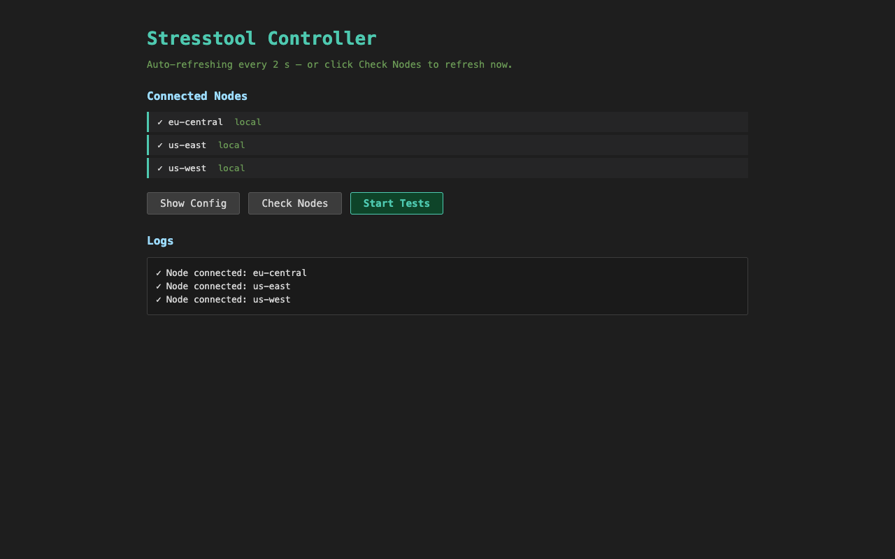

# Distributed Stress Testing Tool

A flexible HTTP stress testing tool that supports both standalone and distributed execution modes.

## Architecture Overview

The tool has been refactored to support a **Controller-Node** architecture for distributed load testing:

### Components

1. **Controller**: 
   - Loads the test configuration file
   - Waits for worker nodes to connect
   - Distributes test specifications to all connected nodes
   - Coordinates test execution start
   - Aggregates and displays results from all nodes

2. **Node (Worker)**:
   - Connects to the controller
   - Receives test specifications
   - Executes tests with node-specific overrides
   - Reports progress and results back to the controller

3. **Standalone Mode**:
   - Traditional single-instance execution
   - No network communication required

## Usage

### 1. Standalone Mode (Single Machine)

Run tests directly without distribution:

```bash
./stresstool run -f config.yaml
```

Options:
- `-f, --file`: Path to YAML configuration file (required)
- `--verbose`: Print detailed logs
- `--dry-run`: Validate config without executing tests
- `--parallel`: Run all tests in parallel

### 2. Distributed Mode (Controller + Nodes)

#### Step 1: Start the Controller

```bash
./stresstool controller -f config.yaml --listen :8090
```

The controller will:
- Load the configuration
- Listen for node connections
- Wait for your command to start tests

Options:
- `-f, --file`: Path to YAML configuration file (required)
- `--listen`: Address to listen on (default: `:8090`)
- `--web`: Enable the web UI for triggering tests
- `--web-port`: Port for the web UI server (default: `8091`, requires `--web`)
- `--parallel`: Run tests in parallel on each node
- `--verbose`: Print detailed logs

#### Step 2: Start Worker Nodes

On each worker machine, run:

```bash
# Node A
./stresstool node --node-name node-a --controller controller-host:8090

# Node B
./stresstool node --node-name node-b --controller controller-host:8090

# Node C
./stresstool node --node-name node-c --controller controller-host:8090
```

Each node will:
- Connect to the controller
- Identify itself by name
- Wait for test specifications

Options:
- `--node-name`: Unique name for this node (required)
- `--controller`: Controller address to connect to (required)
- `--verbose`: Print detailed logs

#### Step 3: Start Tests from Controller

Once all nodes are connected, type `start` in the controller terminal:

```
Type 'start' when ready to begin tests, or 'nodes' to see connected nodes:
> nodes
Connected nodes (3):
  - node-a
  - node-b
  - node-c

> start
Starting tests on 3 node(s)...
```

The controller will:
1. Send test specifications to all nodes
2. Signal nodes to start simultaneously
3. Display real-time progress from all nodes
4. Aggregate and display final results

### 3. Controller Web Mode

The controller includes an optional web UI for managing tests from a browser. Enable it with the `--web` flag:

```bash
# Start controller with web UI on default port (8091)
./stresstool controller -f config.yaml --listen :8090 --web

# Or specify a custom web UI port
./stresstool controller -f config.yaml --listen :8090 --web --web-port 9000
```

Options:
- `--web`: Enable the web UI (disabled by default)
- `--web-port`: Port for the web UI server (default: `8091`, requires `--web`)

Once running, open `http://localhost:8091` in your browser. The UI auto-refreshes every 2 seconds and shows all connected nodes. Click **Start Tests** to trigger execution, or continue using the terminal commands (`start` / `nodes`) as usual.



## Configuration

### Authentication

Define authentication at the top level of your config using the `auth` key. Only **one** auth type is allowed per config file. All tests use it automatically — set `auth: false` on individual tests to opt out.

Auth field values support `{{ }}` placeholders just like headers and body.

**Supported auth types:**

```yaml
# Basic Auth — sends Authorization: Basic <base64(user:pass)>
auth:
  basic_auth:
    username: admin
    password: "{{ get_password() }}"

# Bearer Token — sends Authorization: Bearer <token>
auth:
  bearer:
    token: "{{ get_token() }}"

# API Key — sends a custom header
auth:
  api_key:
    header: X-API-Key
    key: "my-secret-key"

# OAuth2 Client Credentials — fetches token from token_url, sends Authorization: Bearer <token>
auth:
  oauth2_client_credentials:
    token_url: https://auth.example.com/token
    client_id: my-client
    client_secret: "{{ get_secret() }}"
    scopes: ["read", "write"]
```

OAuth2 tokens are cached and automatically refreshed when they expire.

### Warmup (Ramp-Up) Phase

Add an optional `warmup_seconds` field to any test to linearly ramp the request
rate from zero up to the configured `requests_per_second` before the main run
begins. This lets the target system (and any autoscalers, caches, or connection
pools) settle before full load hits.

```yaml
tests:
  - name: api_test
    path: "https://api.example.com/endpoint"
    method: "GET"
    requests_per_second: 100
    threads: 10
    warmup_seconds: 15   # linear ramp from 0 → 100 RPS over 15s
    run_seconds: 60      # 60s of steady load at 100 RPS afterwards
```

Total test duration with a warmup is `warmup_seconds + run_seconds` — in the
example above, 75 seconds total. Metrics cover the entire window, so RPS shown
during warmup will appear lower than the target until the ramp completes. When
`warmup_seconds` is omitted or set to `0`, the runner behaves exactly as
before: full RPS from t=0.

Node overrides may also tune warmup per node (`warmup_seconds: -1` disables
warmup for a specific node, `0` inherits from the test default).

### Node-Specific Overrides

You can configure different load parameters for specific nodes in your YAML config:

```yaml
tests:
  - name: api_load_test
    path: "https://api.example.com/endpoint"
    method: "POST"
    requests_per_second: 100  # Default for all nodes
    threads: 10               # Default for all nodes
    run_seconds: 60
    
    # Node-specific overrides
    nodes:
      node-a:
        requests_per_second: 50
        threads: 5
      node-b:
        requests_per_second: 150
        threads: 15
      node-c:
        requests_per_second: 100
        # Uses default threads: 10
```

### Example Configuration

See `example-config.yaml` for a complete example:

```yaml
funcs:
  - name: get_password
    cmd: ["echo", "test-password-12345"]

auth:
  basic_auth:
    username: "testuser"
    password: "{{ get_password() }}"

tests:
  - name: api_login_test
    path: "https://httpbin.org/post"
    method: "POST"
    requests_per_second: 5
    threads: 2
    run_seconds: 10

    # Auth headers (Authorization: Basic ...) are added automatically.
    headers:
      X-Request-Id: "{{ uuid() }}"
      X-Timestamp: "{{ now() }}"
      Content-Type: "application/json"

    body: >
      {
        "username": "testuser",
        "timestamp": "{{ now() }}"
      }

    assert:
      status_code: 200
      body_contains: "json"
      max_latency_ms: 2000

    nodes:
      node-a:
        requests_per_second: 3
        threads: 1
      node-b:
        requests_per_second: 8

  - name: api_get_public
    path: "https://httpbin.org/get"
    method: "GET"
    auth: false  # Disable auth for this test
    requests_per_second: 10
    threads: 3
    run_seconds: 5

    assert:
      status_code: 200
      max_latency_ms: 1000
```

## Communication Protocol

The controller and nodes communicate over **gRPC** using a bidirectional
`Session` stream (`StressTestService` in `proto/api/v1/payload.proto`). Messages
are protobuf `oneof` variants on `NodeMessage` (node → controller) and
`ControllerMessage` (controller → node).

### Message flow (high level)

1. **Hello**: Node opens the stream and sends hello (name + version).
2. **TestSpec**: After you start a run, the controller sends each node its config slice.
3. **Ready**: Node validates config and responds with ready (or **Error** if validation fails).
4. **StartTests**: Controller tells all ready nodes to begin execution.
5. **Progress** / **TestResult**: Node streams progress and final metrics.
6. **StopTests** (optional): Controller can request early cancellation (e.g. web **Stop** or API).
7. **Complete**: Controller closes the logical run; nodes may disconnect.

By default, traffic is **plaintext gRPC** (`--insecure` defaults to true on
`controller` and `node`). For TLS or mTLS, set `--insecure=false` and pass
`--tls-cert`, `--tls-key`, and when needed `--tls-ca` (see `internal/cli/tls.go`).

### Protobuf / Buf

Payload schemas live in `proto/api/v1/payload.proto`. Regenerating Go code from them requires the **[Buf CLI](https://buf.build/docs/installation)**.

**Install Buf (macOS / Homebrew):**

```bash
brew install bufbuild/buf/buf
```

Module and codegen config: `buf.yaml`, `buf.gen.yaml`. From the repository root:

```bash
buf generate
```

This runs the remote `protocolbuffers/go` and `grpc/go` plugins configured in `buf.gen.yaml` and writes generated files under `internal/protocol/payloadpb/`.

## Benefits of Distributed Mode

1. **Higher Load**: Distribute load across multiple machines to test at scale
2. **Geographic Distribution**: Run nodes in different regions to test from multiple locations
3. **Node Specialization**: Configure different load profiles per node
4. **Centralized Control**: Single point to coordinate and monitor all tests
5. **Aggregated Results**: View combined results from all nodes in one place

## Example Distributed Test Scenario

```bash
# Terminal 1: Start Controller
./stresstool controller -f load-test.yaml --listen :8090

# Terminal 2: Node in US-East
./stresstool node --node-name us-east --controller localhost:8090

# Terminal 3: Node in US-West
./stresstool node --node-name us-west --controller localhost:8090

# Terminal 4: Node in EU
./stresstool node --node-name eu-central --controller localhost:8090

# Back to Terminal 1: Check nodes and start
> nodes
Connected nodes (3):
  - us-east
  - us-west
  - eu-central

> start
```

The controller will coordinate all three nodes to execute tests simultaneously, with each node applying its specific configuration overrides.

## Monitoring

### Real-Time Progress

During test execution, the controller displays live updates from all nodes:

```
→ us-east / api_login_test: 5s elapsed - 25 requests, 5.0 RPS, 0 failures
→ us-west / api_login_test: 5s elapsed - 40 requests, 8.0 RPS, 1 failures
→ eu-central / api_login_test: 5s elapsed - 15 requests, 3.0 RPS, 0 failures
```

### Final Results

After all tests complete, view aggregated metrics per node:

```
=== Node: us-east ===
Test: api_login_test
  Requests: 50 total, 50 success, 0 failures
  Latency: Min: 45ms, Avg: 123ms, Max: 456ms, P95: 234ms, P99: 345ms
  Result: ✓ PASSED

=== Node: us-west ===
...
```

## Build from Source

**Toolchain:** [Go](https://go.dev/dl/) 1.26.1+ (see `go.mod`). To regenerate protobuf/gRPC Go stubs after editing `proto/`, install Buf (e.g. `brew install bufbuild/buf/buf`) and run `buf generate`.

```bash
git clone <repository-url>
cd stresstool
go build -o stresstool ./cmd/stresstool
```

### Install Globally
```bash
go install ./cmd/stresstool
```

## Dependency Maintenance and Risk Checks

Use the helper script below to check for outdated modules and known
vulnerabilities:

```bash
./scripts-deps-check.sh
```

To attempt dependency upgrades first, then run the same risk checks:

```bash
./scripts-deps-check.sh --upgrade
```

The script runs:

- `go list -m -u all` to report outdated dependencies
- `govulncheck ./...` to find known vulnerabilities in reachable code paths

## Cloud Deployment with Terraform

Terraform configurations are provided for deploying stresstool's controller-node architecture on **AWS**, **GCP**, and **Azure**. Each configuration creates a dedicated network, firewall/security rules, a controller VM, and a configurable number of worker node VMs.

### Prerequisites

- [Terraform](https://developer.hashicorp.com/terraform/downloads) >= 1.5
- Cloud provider CLI authenticated (`aws configure`, `gcloud auth login`, or `az login`)

### Quick Start

```bash
cd terraform/aws    # or terraform/gcp / terraform/azure
terraform init
terraform plan
terraform apply
```

### Provider-Specific Variables

#### AWS

| Variable | Description | Default |
|---|---|---|
| `aws_region` | AWS region | `us-east-1` |
| `instance_type` | EC2 instance type | `t3.medium` |
| `node_count` | Number of worker nodes | `3` |
| `key_name` | EC2 key pair name (required) | — |
| `allowed_ssh_cidr` | CIDR allowed to SSH | `0.0.0.0/0` |
| `controller_port` | Controller listen port | `8090` |

```bash
terraform apply -var="key_name=my-keypair" -var="node_count=5"
```

#### GCP

| Variable | Description | Default |
|---|---|---|
| `project_id` | GCP project ID (required) | — |
| `region` | GCP region | `us-central1` |
| `zone` | GCP zone | `us-central1-a` |
| `machine_type` | GCE machine type | `e2-medium` |
| `node_count` | Number of worker nodes | `3` |
| `allowed_ssh_cidr` | CIDR allowed to SSH | `0.0.0.0/0` |
| `controller_port` | Controller listen port | `8090` |

```bash
terraform apply -var="project_id=my-gcp-project"
```

#### Azure

| Variable | Description | Default |
|---|---|---|
| `location` | Azure region | `East US` |
| `vm_size` | VM size | `Standard_B2s` |
| `node_count` | Number of worker nodes | `3` |
| `admin_username` | VM admin user | `azureuser` |
| `ssh_public_key_path` | Path to SSH public key | `~/.ssh/id_rsa.pub` |
| `allowed_ssh_cidr` | CIDR allowed to SSH | `0.0.0.0/0` |
| `controller_port` | Controller listen port | `8090` |

```bash
terraform apply -var="location=West US 2"
```

### Opening the Controller Port to the Web

By default, the controller port (8090) is only accessible from within the private network (VPC/VNet). To expose it externally — for example, to connect worker nodes from other networks or to access the controller from the internet:

#### AWS

Add a public ingress rule to the controller security group:

```hcl
# In terraform/aws/main.tf, add to aws_security_group.controller:
ingress {
  description = "Controller port from the web"
  from_port   = 8090
  to_port     = 8090
  protocol    = "tcp"
  cidr_blocks = ["0.0.0.0/0"]   # or restrict to your IP
}
```

#### GCP

Update the firewall source range:

```hcl
# In terraform/gcp/main.tf, change google_compute_firewall.allow_controller:
source_ranges = ["0.0.0.0/0"]   # instead of source_tags
# Remove: source_tags = ["stresstool-node"]
```

#### Azure

Add an NSG rule for external access:

```hcl
# In terraform/azure/main.tf, add to azurerm_network_security_group.controller:
security_rule {
  name                       = "ControllerWeb"
  priority                   = 1003
  direction                  = "Inbound"
  access                     = "Allow"
  protocol                   = "Tcp"
  source_port_range          = "*"
  destination_port_range     = "8090"
  source_address_prefix      = "0.0.0.0/0"   # or restrict to your IP
  destination_address_prefix = "*"
}
```

> **Security note:** Exposing the controller port to `0.0.0.0/0` makes it accessible from the entire internet. In production, restrict `allowed_ssh_cidr` and the controller port to known IP ranges.

### Outputs

After `terraform apply`, all providers output:

- **Controller public/private IPs**
- **Node public/private IPs**
- **SSH command** to connect to the controller

### Cleanup

```bash
terraform destroy
```

## Architecture Benefits

- **Separation of Concerns**: Controller handles coordination, nodes handle execution
- **Scalability**: Add more nodes to increase load capacity
- **Flexibility**: Mix standalone and distributed modes as needed
- **Observability**: Centralized progress monitoring and result aggregation
